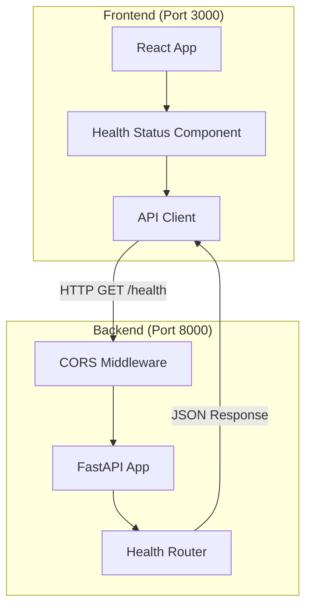

# Design Document

## Overview

This design outlines the reorganization of the existing FastAPI monolithic application into a modern backend-frontend architecture. The backend will remain a FastAPI service with minimal changes, while the frontend will be a new React application built with TypeScript and modern best practices. The frontend will consume the backend's health check API to display real-time service status information.

## Architecture

### High-Level Architecture



### Directory Structure

```
project-root/
├── backend/                    # FastAPI application
│   ├── app/
│   │   ├── __init__.py
│   │   ├── main.py
│   │   ├── config.py
│   │   ├── models/
│   │   ├── routers/
│   │   ├── services/
│   │   └── utils/
│   ├── tests/
│   ├── requirements.txt
│   ├── pyproject.toml
│   ├── Dockerfile
│   └── README.md
├── frontend/                   # React application
│   ├── src/
│   │   ├── components/
│   │   │   ├── HealthStatus.tsx
│   │   │   └── ErrorBoundary.tsx
│   │   ├── services/
│   │   │   └── api.ts
│   │   ├── types/
│   │   │   └── health.ts
│   │   ├── utils/
│   │   │   └── dateFormatter.ts
│   │   ├── App.tsx
│   │   ├── main.tsx
│   │   └── index.css
│   ├── public/
│   ├── package.json
│   ├── tsconfig.json
│   ├── vite.config.ts
│   ├── tailwind.config.js
│   ├── Dockerfile
│   └── README.md
├── docker-compose.yml
└── README.md
```

## Components and Interfaces

### Backend Components

#### FastAPI Application (Existing)
- **Location**: `backend/app/main.py`
- **Responsibility**: Main application entry point with middleware and routing
- **Changes**: Update CORS configuration to allow frontend origin

#### Health Router (Existing)
- **Location**: `backend/app/routers/health.py`
- **Responsibility**: Provides health check endpoints
- **Changes**: None required

#### Configuration (Existing)
- **Location**: `backend/app/config.py`
- **Responsibility**: Environment-based configuration
- **Changes**: Add frontend URL to CORS origins

### Frontend Components

#### App Component
- **Location**: `frontend/src/App.tsx`
- **Responsibility**: Root application component and layout
- **Props**: None
- **State**: None (stateless container)

#### HealthStatus Component
- **Location**: `frontend/src/components/HealthStatus.tsx`
- **Responsibility**: Displays health status information and manages API calls
- **Props**: None
- **State**: 
  - `healthData: HealthResponse | null`
  - `loading: boolean`
  - `error: string | null`
  - `lastUpdated: Date | null`

#### ErrorBoundary Component
- **Location**: `frontend/src/components/ErrorBoundary.tsx`
- **Responsibility**: Catches and displays React errors gracefully
- **Props**: `children: ReactNode`
- **State**: `hasError: boolean`, `error: Error | null`

#### API Service
- **Location**: `frontend/src/services/api.ts`
- **Responsibility**: HTTP client for backend communication
- **Methods**: 
  - `getHealthStatus(): Promise<HealthResponse>`
  - `handleApiError(error: unknown): string`

### Data Models

#### HealthResponse Interface (Frontend)
```typescript
interface HealthResponse {
  status: string;
  timestamp: string;
  version: string;
  service: string;
}
```

#### API Error Interface (Frontend)
```typescript
interface ApiError {
  message: string;
  code?: string;
  timestamp: Date;
}
```

## Technology Stack

### Backend
- **Framework**: FastAPI (existing)
- **Language**: Python 3.9+
- **Package Manager**: uv
- **Dependencies**: No changes to existing dependencies

### Frontend
- **Framework**: React 18+ with TypeScript
- **Build Tool**: Vite (fast development and build)
- **Styling**: Tailwind CSS (utility-first CSS framework)
- **HTTP Client**: Axios (robust HTTP client with interceptors)
- **Date Handling**: date-fns (lightweight date utility library)
- **Development Server**: Vite dev server
- **Package Manager**: npm

### Development Tools
- **TypeScript**: For type safety and better developer experience
- **ESLint**: Code linting with React and TypeScript rules
- **Prettier**: Code formatting
- **Vite**: Fast development server and build tool

## Error Handling

### Backend Error Handling
- **Existing**: Comprehensive error handling with structured responses
- **Changes**: None required - existing error handling is sufficient

### Frontend Error Handling

#### Network Errors
- **Strategy**: Axios interceptors for global error handling
- **Implementation**: Display user-friendly messages for network failures
- **Retry Logic**: Automatic retry for failed health checks after 5 seconds

#### React Errors
- **Strategy**: Error boundaries to catch component errors
- **Implementation**: Fallback UI with error message and refresh option
- **Logging**: Console logging for development debugging

#### API Response Errors
- **Strategy**: Validate API responses and handle malformed data
- **Implementation**: Type guards for response validation
- **Fallback**: Display "Service Unavailable" when data is invalid

## Testing Strategy

### Backend Testing
- **Existing**: Comprehensive test suite with pytest
- **Changes**: None required - existing tests cover health endpoints

### Frontend Testing
- **Unit Tests**: Jest and React Testing Library for component testing
- **Integration Tests**: Test API service integration with mock server
- **E2E Tests**: Cypress for end-to-end testing (optional for MVP)

#### Test Coverage Goals
- **Components**: 90%+ coverage for HealthStatus and ErrorBoundary
- **Services**: 100% coverage for API service
- **Utils**: 100% coverage for utility functions

### Testing Scenarios
1. **Successful Health Check**: Verify correct display of healthy status
2. **Failed Health Check**: Verify error handling and display
3. **Network Timeout**: Verify timeout handling and retry logic
4. **Malformed Response**: Verify graceful handling of invalid data
5. **Component Error**: Verify error boundary functionality

## Performance Considerations

### Frontend Performance
- **Bundle Size**: Use Vite's tree shaking and code splitting
- **API Calls**: Implement debouncing for rapid refresh attempts
- **Caching**: Cache health status for 5 seconds to reduce API calls
- **Loading States**: Provide immediate feedback during API calls

### Backend Performance
- **Existing**: FastAPI provides excellent performance
- **CORS**: Minimal overhead for CORS middleware
- **No Changes**: Existing performance optimizations remain

## Security Considerations

### CORS Configuration
- **Backend**: Configure specific origins instead of wildcard
- **Development**: Allow localhost:3000 for development
- **Production**: Configure specific production frontend URL

### API Security
- **Existing**: FastAPI security features remain unchanged
- **Headers**: Ensure proper security headers in responses
- **Rate Limiting**: Consider adding rate limiting for health endpoints

### Frontend Security
- **Environment Variables**: Use Vite's environment variable system
- **API URLs**: Configure backend URL via environment variables
- **XSS Protection**: React's built-in XSS protection via JSX

## Deployment Strategy

### Development Environment
- **Backend**: Run on port 8000 with hot reload
- **Frontend**: Run on port 3000 with Vite dev server
- **CORS**: Configure backend to allow localhost:3000

### Production Environment
- **Docker**: Multi-stage builds for both services
- **Docker Compose**: Orchestrate both services with proper networking
- **Environment Variables**: Configure URLs and ports via environment
- **Health Checks**: Docker health checks for both services

### CI/CD Considerations
- **Build Process**: Separate build steps for backend and frontend
- **Testing**: Run tests for both services in parallel
- **Deployment**: Deploy both services together or independently